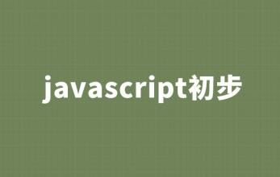

# 第一阶段：JavaWeb前端技术
  Java作为一种web开发技术，学习Java，首先就应该了解Web前端技术，本阶段就将带领大家一起学习Java web开发中的，html、css、JavaScript、jquery等前端相关技术，助你开发出更加友好的Java应用。

## [Web前端开发之HTML+CSS基础入门](http://www.maiziedu.com/course/425/)

## [Javascript初步](http://www.maiziedu.com/course/353/)

## [Web前端开发之jQuery入门课程](http://www.maiziedu.com/course/354/)