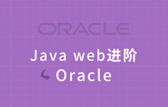

# 第三阶段：JavaWeb进阶

  Java Web进阶阶段，主要是对Java框架的学习，包括Struts2、Hibernate、Spring、Oracle、Lucene等框架，并通过Java商城开发项目和移动接口项目讲解，将这些知识运用于实际Java开发中，让学员知其然，更知其所以然。

## [Java Web进阶-Oracle](http://www.maiziedu.com/course/359/)

## [JAVA项目实战-嗨购网上商城](http://www.maiziedu.com/course/360/)

### [项目三.移动接口](http://www.maiziedu.com/course/java/)

## 项目三.移动接口

## [电子商务网站搜索开发基础-Lucene](http://www.maiziedu.com/course/511/)
