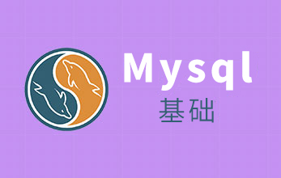
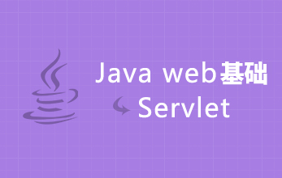
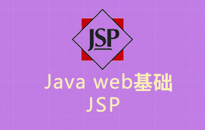
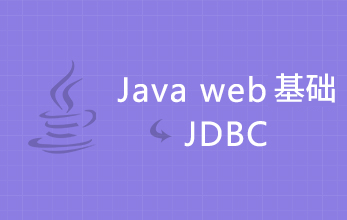
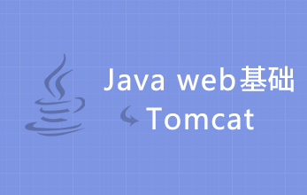
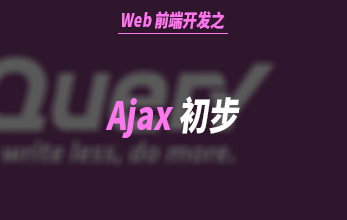
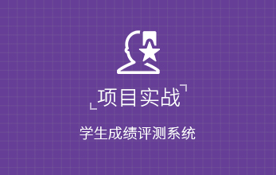

# 第二阶段：JavaWeb初级

  Java Web初级开发阶段，主要是学习Java语言基础、Mysql、servlet、JSP、JDBC、Tomcat、Ajax等基础知识，并通过一个简单的系统开发，巩固初学者对Java基础知识的掌握。

## [Java 语言基础](http://www.maiziedu.com/course/348/)

## [Mysql基础](http://www.maiziedu.com/course/349/)

## [Java Web基础-servlet](http://www.maiziedu.com/course/365/)

## [Java Web基础-JSP](http://www.maiziedu.com/course/366/)

## [Java Web基础-JDBC](http://www.maiziedu.com/course/350/)

## [Java Web基础-Tomcat](http://www.maiziedu.com/course/367/)

## [Web前端开发之Ajax初步](http://www.maiziedu.com/course/351/)

## [项目实战：学生成绩评测系统](http://www.maiziedu.com/course/355/)

