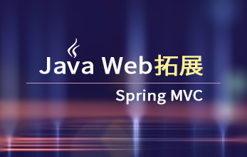

# 第四阶段：JavaWeb拓展（选修）
  Java Web拓展知识的学习，主要包括HTML5、CSS3、Jsf、Freemarker、Mybatis、Weblogic、Maven、Spring MVC、java servlet 3.0新特性、JBPM、Lucene等，全面掌握Java相关知识，让Java开发更容易一点。

## [Web前端开发之HTML5+CSS3快速入门](http://www.maiziedu.com/course/352/)

## [Java Web扩展-Jsf](http://www.maiziedu.com/course/361/)

## [Java Web扩展-Freemarker](http://www.maiziedu.com/course/362/)

## [Java Web进阶-Mybatis](http://www.maiziedu.com/course/357/)

## [Java Web扩展-Weblogic](http://www.maiziedu.com/course/364/)

## [Java Web扩展-Maven](http://www.maiziedu.com/course/369/)

## [Java Web拓展-Spring MVC](http://www.maiziedu.com/course/426/)

## [java servlet 3.0新特性](http://www.maiziedu.com/course/487/)

## [JBPM从入门到高级开发](http://www.maiziedu.com/course/534/)

## [电子商务网站搜索开发基础-Lucene](http://www.maiziedu.com/course/539/)

## [Javascript 进阶](http://www.maiziedu.com/course/582/)

## [Microsoft SQL Server 2014数据库基础知识](http://www.maiziedu.com/course/614/)

